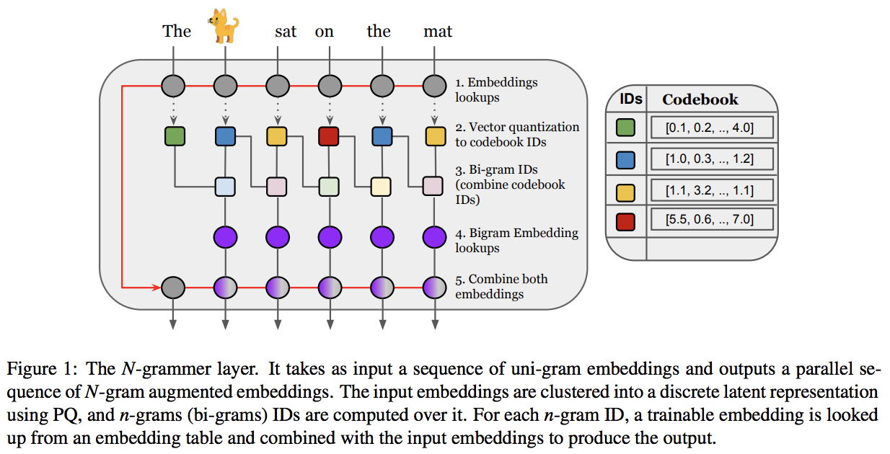

</img>

# n-grammer-flax
Implementation of <a href="https://arxiv.org/abs/2207.06366">N-Grammer</a>: Augmenting Transformers with latent n-grams in Flax

## Usage
```python
from n_grammer_flax.n_grammer_flax import PQNgrammer
import jax

key0, key1, key2 = jax.random.split(random.PRNGKey(0), 3)

init_rngs = {'params': key1, 
             'batch_stats': key2}
x = jax.random.normal(key0, shape=(1, 1024, 32 * 16))    
pq_ngram = PQNgrammer(
    num_clusters = 1024, # number of clusters
    num_heads = 32, # number of attention heads
    dim_per_head = 16, # dimensions of each attention head
    ngram_vocab_size = 768 * 256, #ngram vocab size 
    ngram_emb_dim= 16, # ngram embedding 
    decay = 0.99)
pq_ngram(x) #(1,1024,32*16)
```

## Citations

```bibtex
@inproceedings{thai2020using,
    title   = {N-grammer: Augmenting Transformers with latent n-grams},
    author  = {Aurko Roy and Rohan Anil and Guangda Lai and Benjamin Lee and Jeffrey Zhao and Shuyuan Zhang and Shibo Wang and Ye Zhang and Shen Wu and Rigel Swavely and Tao (Alex)Yu and Phuong Dao and Christopher Fifty and Zhifeng Chen and Yonghui Wu},
    year    = {2021},
    url     = {https://arxiv.org/abs/2207.06366}
}